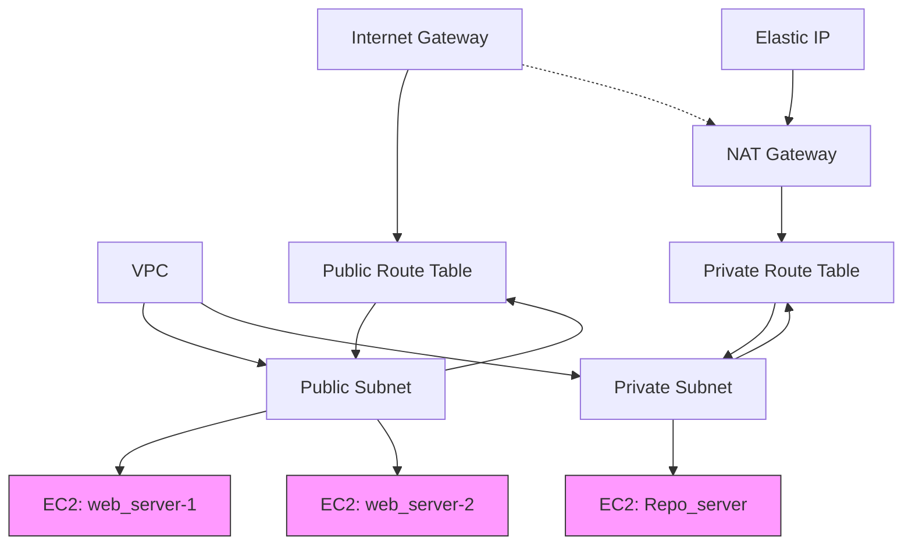

# Project 1 – AWS VPC, EC2, and Networking with Terraform

This project provisions a basic AWS infrastructure using Terraform. It creates a VPC, public and private subnets, security groups, EC2 instances (web servers and a repo server), NAT gateway, and associated networking resources.

## Structure

- **main.tf**: Core infrastructure (VPC, subnets, route tables, EC2, NAT, EIP)
- **providers.tf**: AWS provider configuration
- **variables.tf**: Input variables for customization
- **security_group.tf**: Security groups and rules for public/private subnets
- **user_data_web_1.sh / user_data_web_2.sh**: User data scripts for web servers
- **terraform.tfstate / .backup / .lock.info**: Terraform state files (should not be versioned)
- **.terraform/**: Terraform provider plugins (should not be versioned)

## Architecture Diagram


## Resources Created

- **VPC**: Custom VPC with CIDR block from `variables.tf`
- **Subnets**: Public and private subnets in different AZs
- **Internet Gateway**: For public subnet internet access
- **Route Tables**: Public and private, with associations
- **NAT Gateway**: For private subnet outbound internet
- **Elastic IP**: For NAT Gateway
- **Security Groups**:
  - Public: Allows HTTP (80) and SSH (22) from anywhere
  - Private: Allows SSH (22) from private subnet only
- **EC2 Instances**:
  - `web_server-1` and `web_server-2` in public subnet, each with custom user data
  - `Repo_server` in private subnet

## Usage

1. **Initialize Terraform**
   ```sh
   terraform init
   ```
2. **Plan the deployment**
   ```sh
   terraform plan
   ```
3. **Apply the configuration**
   ```sh
   terraform apply
   ```

## User Data Scripts

- **user_data_web_1.sh**: Installs Python, curl, jq; serves a custom HTML page with EC2 metadata.
- **user_data_web_2.sh**: Similar to web_1, with a different HTML page.

## Variables

See [`variables.tf`](variables.tf) for configurable options like VPC/subnet CIDRs, instance type, and AMI.

## Notes

- Ensure your AWS credentials are configured.
- The key pair `Jenkins-KVP` must exist in your AWS account.
- State files and `.terraform/` are ignored via `.gitignore`.

---

*Generated by reviewing all project files as of the current workspace state.*