# Project 1 – AWS VPC, EC2, and Networking with Terraform

This project provisions a basic AWS infrastructure using Terraform: VPC, public/private subnets, security groups, EC2 instances (web servers and a repo server), NAT gateway, Application Load Balancer, and networking resources.

## Structure

- **main.tf**: Core infrastructure (VPC, subnets, route tables, EC2, NAT, EIP)
- **alb.tf**: Application Load Balancer, target group, listener, and attachments
- **providers.tf**: AWS provider configuration
- **variables.tf**: Input variables for customization
- **security_group.tf**: Security groups and rules
- **outputs.tf**: Outputs for public IPs, ALB DNS, and target group info
- **user_data/**: User data scripts for web servers
- **README.md**: This documentation

> **Note:**  
> Terraform state files (`terraform.tfstate*`), `.terraform/`, and `.terraform.lock.hcl` should not be versioned (see `.gitignore`).

## Architecture Diagram

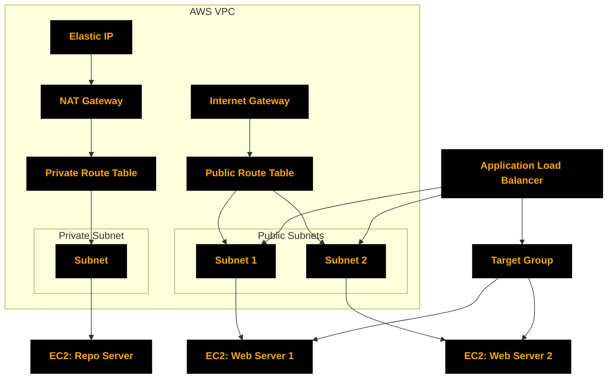

## Resources Created

- **VPC**: Custom CIDR
- **Subnets**: Public/private in different AZs
- **Internet Gateway**: For public subnet access
- **Route Tables**: Public/private, with associations
- **NAT Gateway**: For private subnet outbound internet
- **Elastic IP**: For NAT Gateway
- **Security Groups**: Public (HTTP/SSH), Private (SSH from private subnet)
- **EC2 Instances**: Two web servers (public), one repo server (private)
- **Application Load Balancer**: In public subnets, with HTTP listener and target group
- **Outputs**: Public IPs, ALB DNS, target group info

## Usage

1. **Initialize Terraform**
   ```sh
   terraform init
   ```
2. **Plan the deployment**
   ```sh
   terraform plan
   ```
3. **Apply the configuration**
   ```sh
   terraform apply
   ```

## Variables

See [`variables.tf`](variables.tf) for configurable options (VPC/subnet CIDRs, instance type, AMI, etc).

## Outputs

See [`outputs.tf`](outputs.tf) for details:
- Public IPs of web servers
- ALB DNS name and internal flag
- Target group protocol and stickiness

## Notes

- Ensure your AWS credentials are configured.
- The key pair `Jenkins-KVP` must exist in your AWS account.

---

## Outcomes

By completing this project, we will:

- Gain hands-on experience provisioning AWS infrastructure with Terraform.
- Understand VPC, subnets, security groups, and networking.
- Deploy/manage EC2 instances with user data scripts.
- Set up and test an Application Load Balancer.
- Practice managing Terraform state and version control.

---

## Images

- 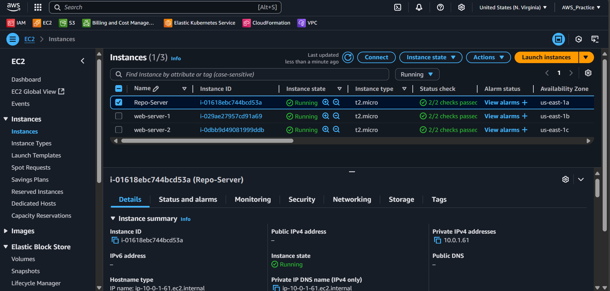
- 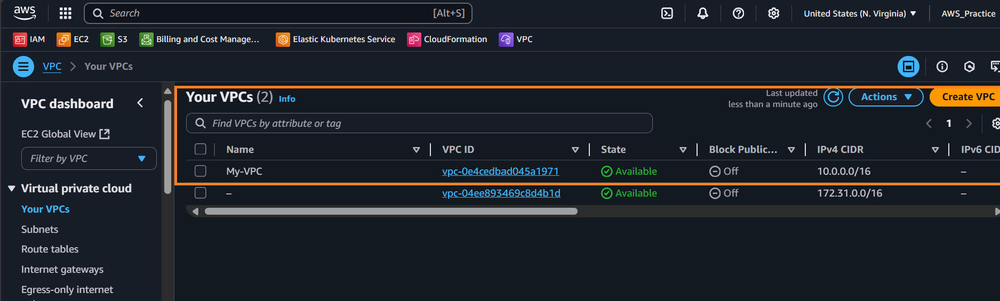
- 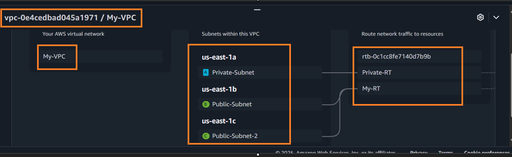
- 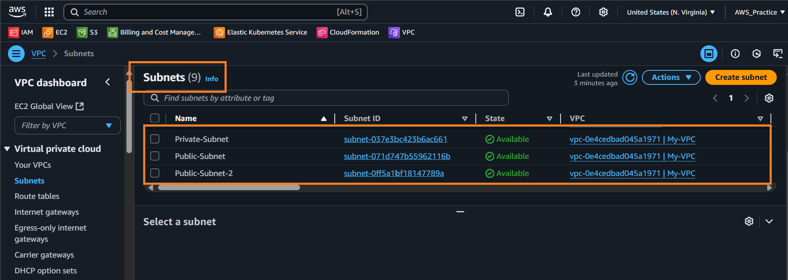
- 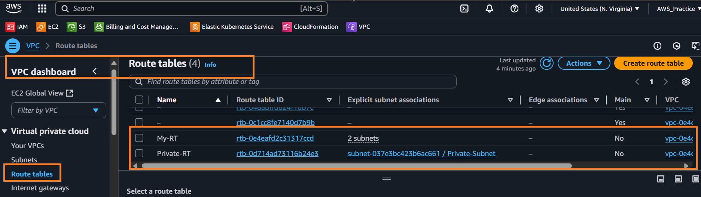
- 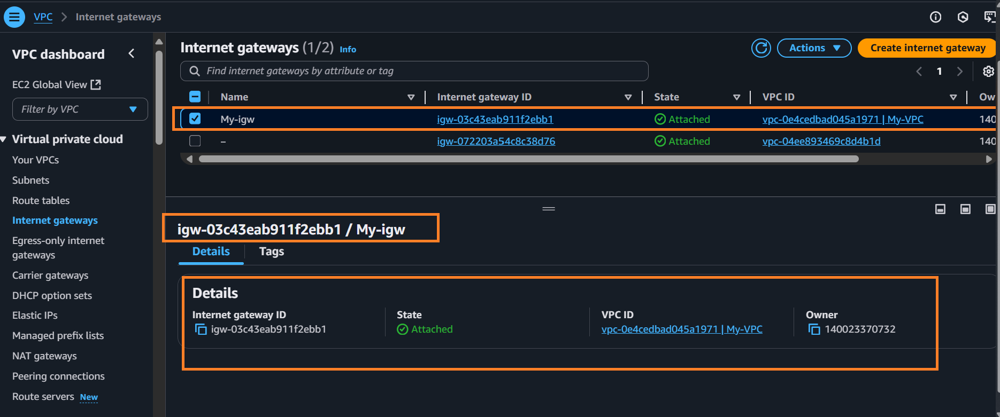
- 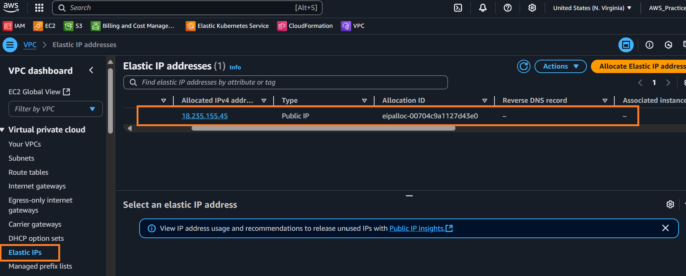
- 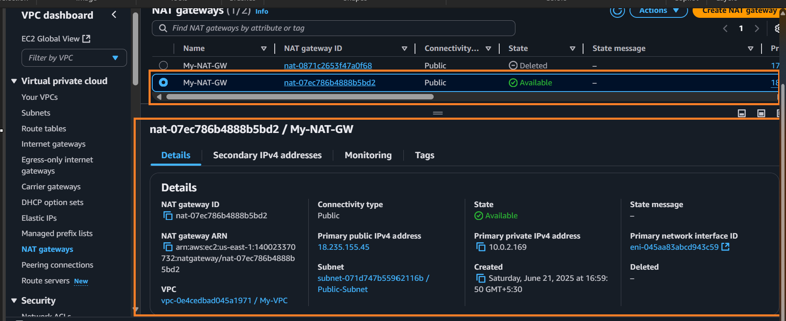
- 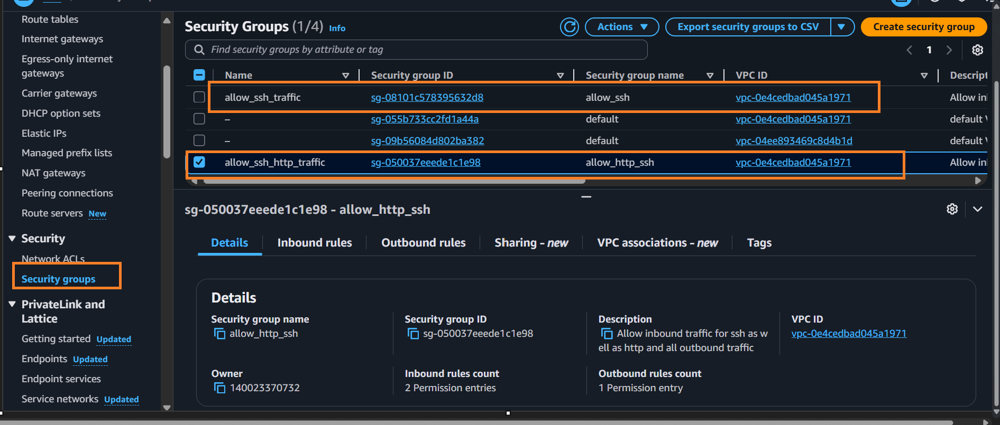
- 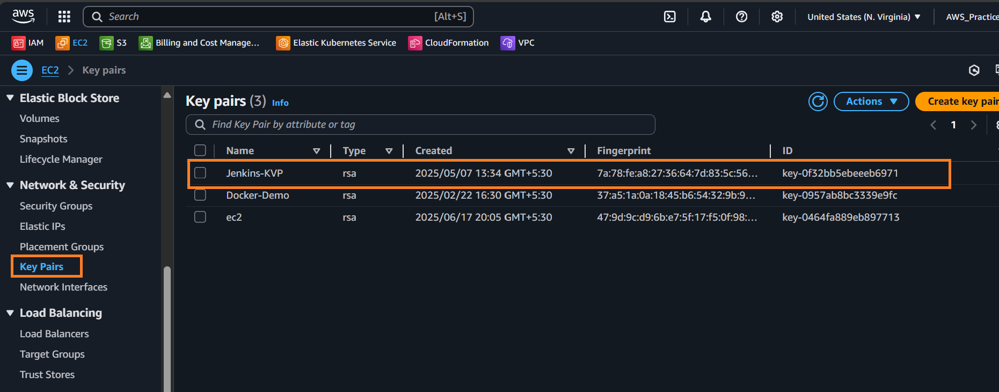
- 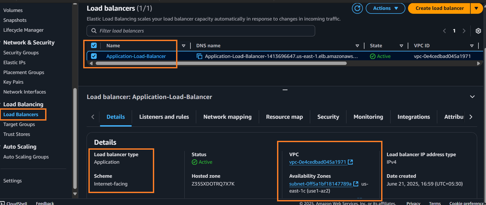
- 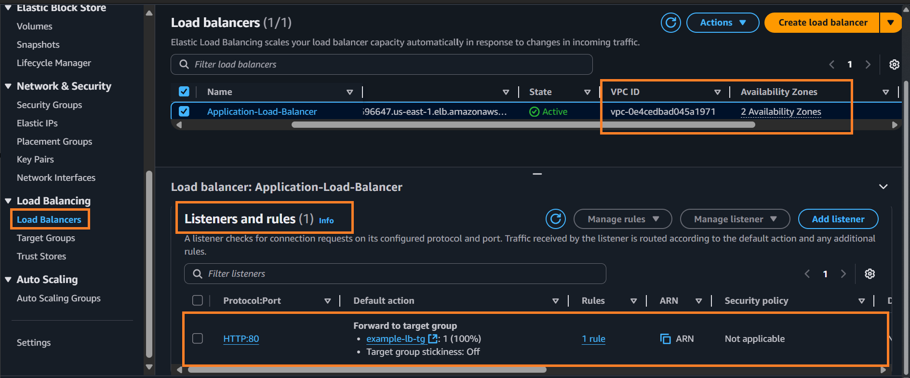
- 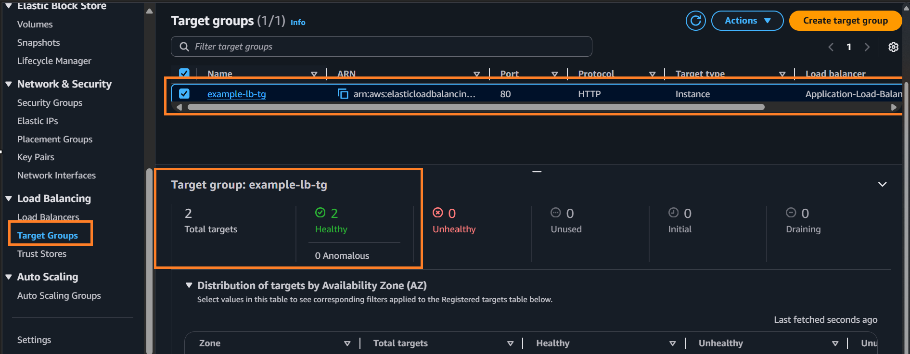
- 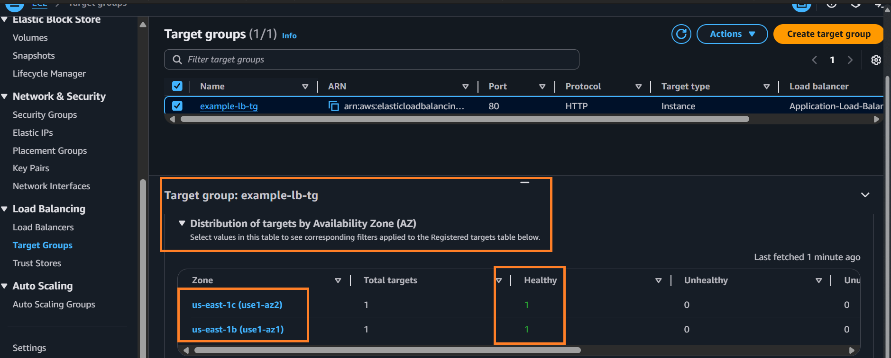
- 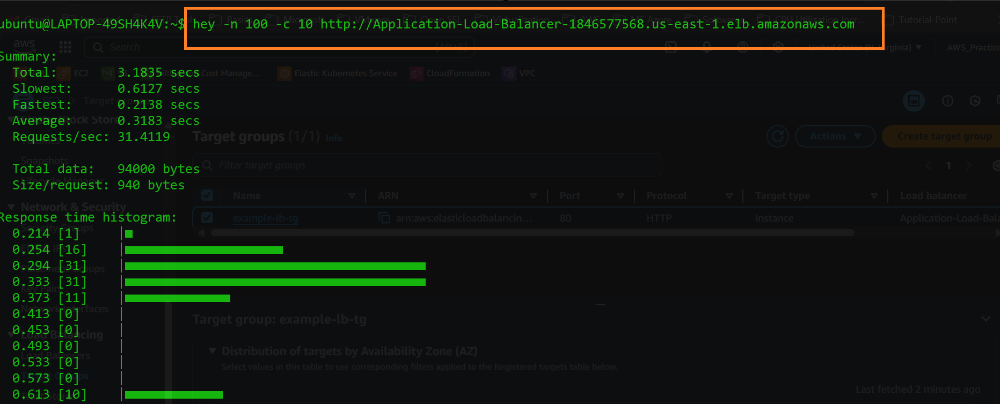
- 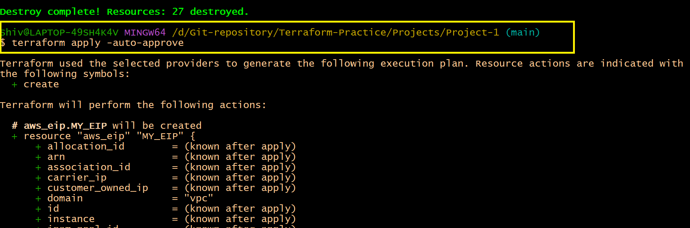
- 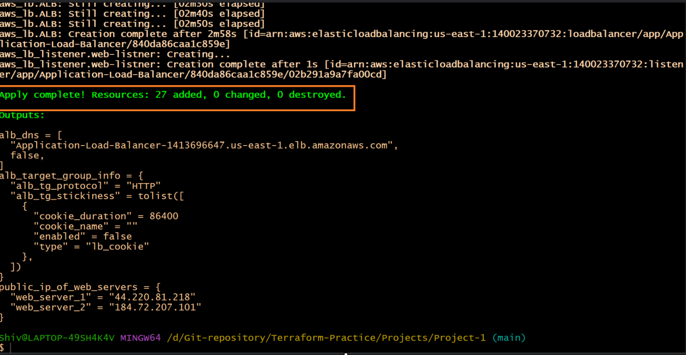
- 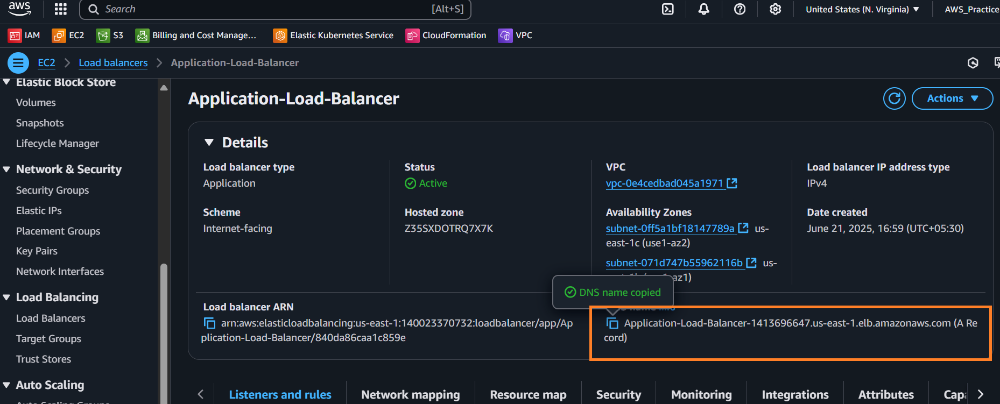
- 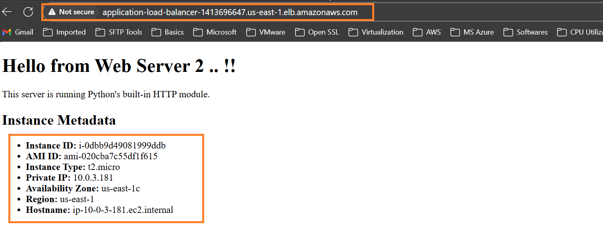
- 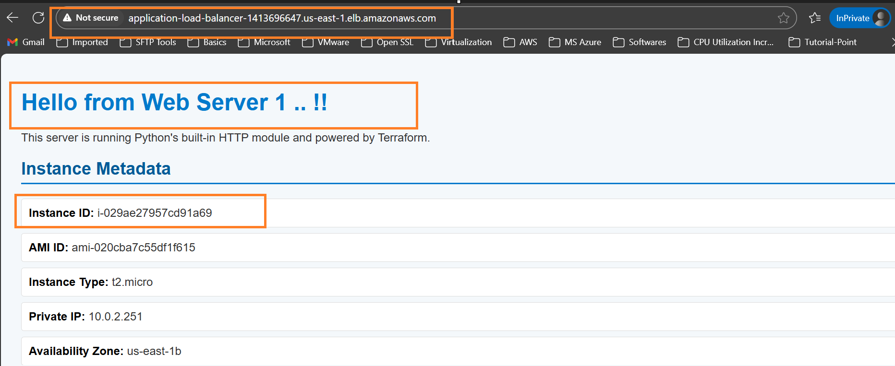
- 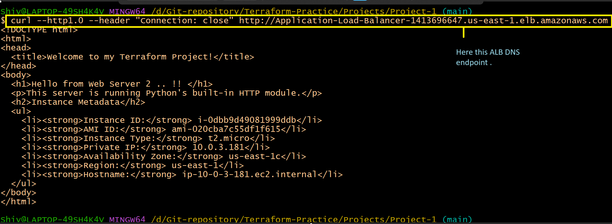
- 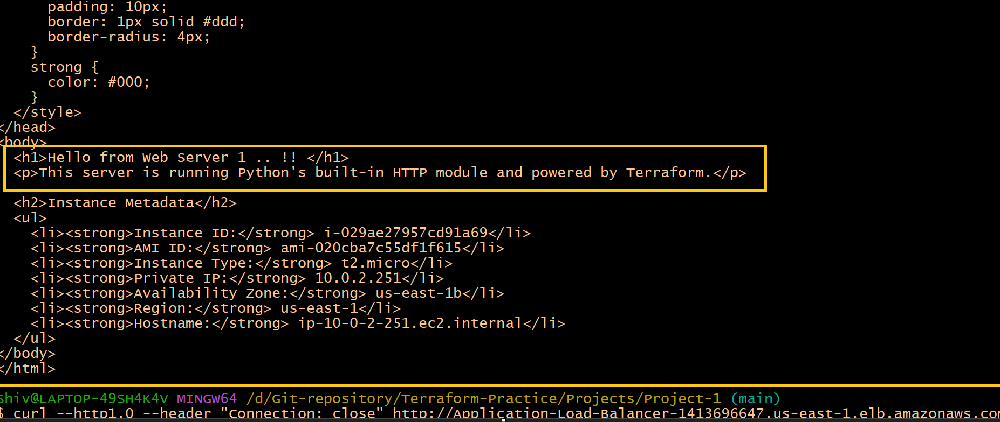
- 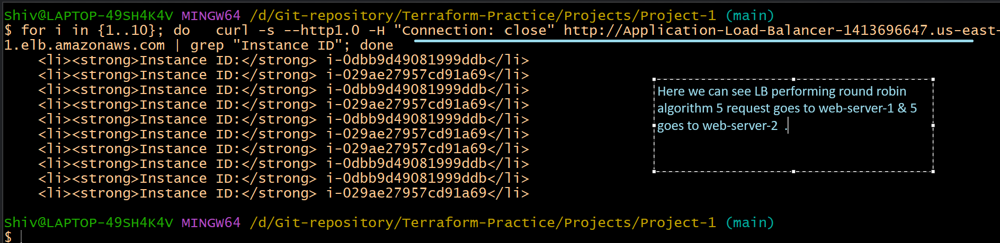

---

## Testing the ALB Behaviour

After deploying, verify the ALB is distributing traffic to your web servers.

**ALB Endpoint:**  
`Application-Load-Balancer-1413696647.us-east-1.elb.amazonaws.com`

**Basic Connectivity Test:**
```sh
curl --http1.0 --header "Connection: close" http://Application-Load-Balancer-1413696647.us-east-1.elb.amazonaws.com
```

**Load Balancing Test:**
```sh
for i in {1..10}; do
   curl -s --http1.0 -H "Connection: close" http://Application-Load-Balancer-1413696647.us-east-1.elb.amazonaws.com | grep "Instance ID"
done
```
You should see alternating "Instance ID" values, confirming ALB routing.